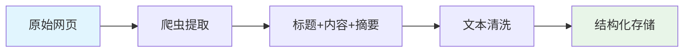
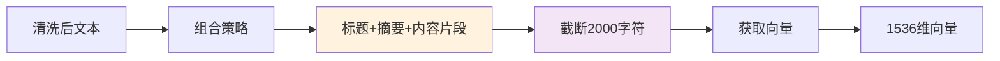
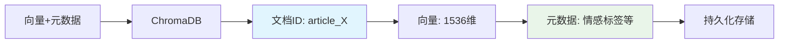
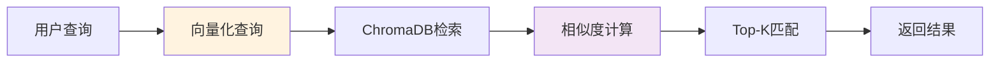
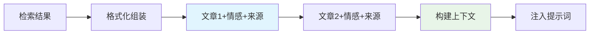
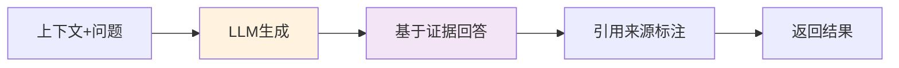

# RAG系统构建各阶段图解

## 阶段1：数据采集与预处理

策略：提取网页关键信息，去除无关内容，标准化文本格式

## 阶段2：向量化处理

策略：组合关键信息进行向量化，限制文本长度防超限

## 阶段3：知识库存储

策略：按ID建立映射，保留元数据便于检索过滤

## 阶段4：检索与匹配

策略：语义相似度检索，支持情感过滤，返回最相关结果

## 阶段5：上下文构建

策略：结构化组装检索结果，构建LLM可理解的上下文

## 阶段6：生成与输出

策略：要求基于检索内容生成，必须标注引用来源