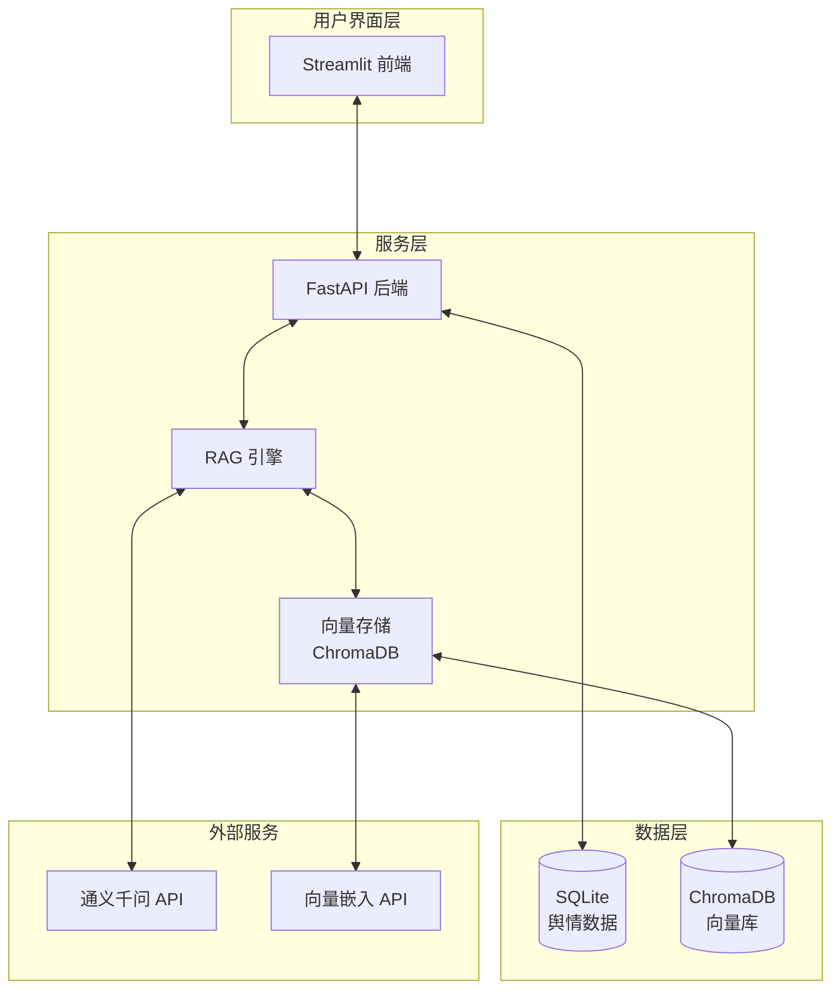
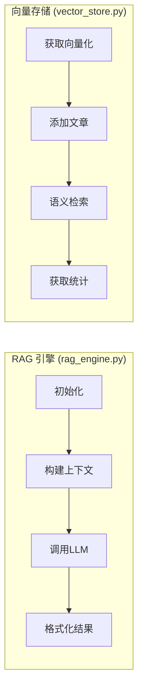
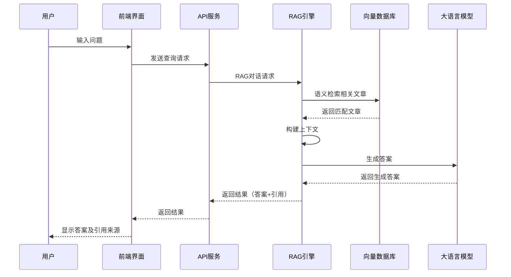
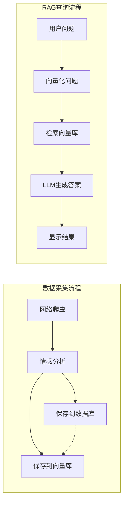

# 舆情监测平台 RAG 系统架构

## 1. 整体系统架构



## 2. RAG 系统内部结构



## 3. RAG 工作流程



## 4. 数据流向



## 5. RAG系统关键特性

### 5.1 检索增强功能
- **语义搜索**：基于ChromaDB的语义相似度检索
- **情感过滤**：支持按情感标签筛选检索结果
- **相关度排序**：按相关度返回最匹配的结果

### 5.2 上下文管理
- **多轮对话**：保留对话历史，支持连续问答
- **上下文长度控制**：避免超出LLM的最大token限制
- **引用追踪**：明确标注答案的信息来源

### 5.3 数据同步机制
- **实时同步**：新分析的文章实时同步到向量库
- **批量同步**：支持手动批量同步数据库文章
- **增量更新**：避免重复向量化已存在的文章

## 6. RAG API接口

```mermaid
graph TD
    A[客户端] --> B[/api/rag/chat]
    A --> C[/api/rag/stats]
    A --> D[/api/rag/sync]

    B --> E[RAG 引擎]
    C --> F[向量存储统计]
    D --> G[数据库同步]

    E --> H[向量检索]
    E --> I[LLM 生成]
    H --> J[ChromaDB]
    I --> K[通义千问 API]

    G --> J
    F --> J
```

## 7. 前端RAG交互界面

```
┌─────────────────────────────────────────────────────┐
│                   智能助手页面                      │
├─────────────────────────────────────────────────────┤
│  ┌─────────────────┐    ┌─────────────────────────┐ │
│  │                 │    │  🤖 舆情智能助手(RAG)    │ │
│  │   知识库信息      │    │                         │ │
│  │  - 文章数: 120   │    │ [对话区域]              │ │
│  │  - 模型: text... │    │ 用户: 最近有什么负面... │ │
│  │                 │    │ 🤖: 根据检索到的文章，... │ │
│  │ [同步知识库]     │    │    [引用来源: 3篇文章]   │ │
│  │                 │    │                         │ │
│  │ 💡 试试问        │    │ [输入框]                │ │
│  │ - 最近负面新闻？ │    │                         │ │
│  │ - 舆情简报      │    │                         │ │
│  └─────────────────┘    └─────────────────────────┘ │
└─────────────────────────────────────────────────────┘
```

## 8. 核心代码结构

### rag_engine.py
```
RAGEngine
├── SYSTEM_PROMPT - 系统提示词
├── __init__ - 初始化
├── _build_context - 构建上下文
└── chat - RAG对话接口
```

### vector_store.py
```
VectorStore
├── __init__ - 初始化
├── _get_embedding - 获取向量
├── add_article - 添加文章
├── search - 检索功能
├── get_stats - 获取统计
└── sync_from_db - 数据库同步
```